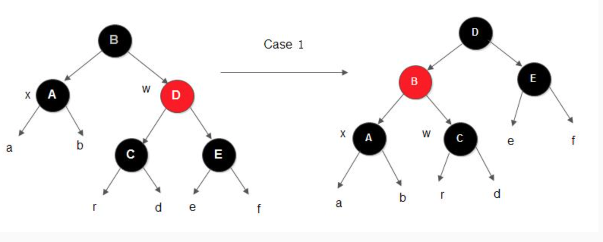
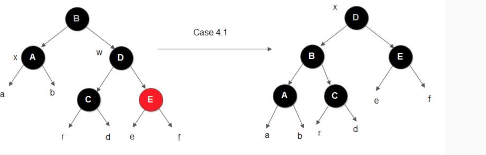

## 红黑树
红黑树有以下性质：
1. 每个节点都是红色或黑色；
2. 根节点为黑色；
3. 每个叶子节点(`nullptr`)是黑色的；
4. 如果一个节点是红色那么他的两个孩子为黑色；
5. 对每个节点，从该节点到其所有后代的节点的简单路径上，均包含相同数量的黑色节点。

> * 红黑树中的叶子节点均指`nil`节点；
> * 性质5保证没有一条路径比其他路径长2倍，因此，红黑树是相对平衡的二叉树。


### `RB_Tree`旋转定义
假设红黑树节点定义如下：
```cpp
enum RBColor { BLACK, RED };

template <class KeyType>
struct RBNode {
  KeyType          key;
  RBColor          color;
  RBNode<KeyType> *left;
  RBNode<KeyType> *right;
  RBNode<KeyType> *parent;

  RBNode(KeyType key, RBColor color, RBNode *p, RBNode *l, RBNode *r)
      : key(key), color(color), parent(p), left(l), right(r) {
  }
};

template <typename T>
class RBTree {
public:
  RBTree();
  ~RBTree();

  void       insert(T key);  // 插入key
  void       remove(T key);  // 删除key
  RBNode<T> *search(T key);  // 查找key
  void       print();

  void preOrder();   // 先序遍历
  void inOrder();    // 中序遍历
  void postOrder();  // 后序遍历

private:
  void leftRotate(RBNode<T> *&root, RBNode<T> *node);   // 左旋
  void rightRotate(RBNode<T> *&root, RBNode<T> *node);  // 右旋

  void insert(RBNode<T> *root, RBNode<T> *node);  // 插入节点
  void insertFixUp(RBNode<T> *root, RBNode<T> *node);
  void destory(RBNode<T> *node);

  void remove(RBNode<T> *&root, RBNode<T> *node);
  void removeFixUp(RBNode<T> *&root, RBNode<T> *node, RBNode<T> *parent);

  RBNode<T> *search(RBNode<T> *root, T key) const;
  void       print(RBNode<T> *root) const;
  void       preOrder(RBNode<T> *root) const;
  void       inOrder(RBNode<T> *root) const;
  void       postOrder(RBNode<T> *root) const;

  RBNode<T> *root;
};
```
* 以某个节点为轴，它的左子树顺时针旋转为左子树，作为新子树的根。成为顺时针旋转或右旋转。

代码实现：
```cpp
// 右旋
template <typename T>
void RBTree<T>::rightRotate(RBNode<T> *&root, RBNode<T> *node) {
  // 获取轴节点的左子树根节点，记为左节点
  RBNode<T> *left = node->left;
  // 左节点的右子树链接到轴节点的左侧，成为轴节点的左子树
  node->left = left->right;

  // 如果左节点的左子树不空，设置其父节点为轴节点
  if (nullptr != left->right) {
    left->right->parent = node;
  }

  // 处理轴节点的父节点与父节点的左右子树
  left->parent = node->parent;

  if (nullptr == node->parent) {
    root = left;
  } else {
    // 轴节点为其父节点的左子树时
    if (node == node->parent->left) {
      // 左节点链接到其左子树上
      node->parent->left = left;
    } else {
      node->parent->right = left;
    }
  }

  // 将轴节点的作为左节点的右子树链接
  left->right  = node;
  node->parent = left;
}
```

* 以某个节点为轴，它的右支逆时针旋转，作为新字数的根，我们称之为左旋。

```cpp
// 左旋
template <typename T>
void RBTree<T>::leftRotate(RBNode<T> *&root, RBNode<T> *node) {
  // 将当前右子树的左子树，改为轴节点的右子树
  RBNode<T> *right = node->right;

  node->right = right->left;

  // 如果左子树不为空，设置其父节点为轴节点
  if (nullptr != right->left) {
    right->left->parent = node;
  }

  // 右子树节点的父节点为轴节点的父节点
  right->parent = node->parent;

  if (nullptr == node->parent) {
    root = right;
  } else {
    // 轴节点为父节点的左节点时，需要将轴节点的父节点的左子树设置为右节点
    if (node == node->parent->left) {
      node->parent->left = right;
    } else {
      // 轴节点为父节点的右子树时，需要将右节点链接到轴的父节点的右子树
      node->parent->right = right;
    }
  }

  // 将轴节点变为到右子树左节点
  right->left  = node;
  node->parent = right;  // 轴节点的父节点改为右子树
}

```

### 红黑树的插入
1. 原理分析
红黑树将新节点`node`作为一个红色节点，插入到叶子节点上，将其孩子指针指向`nil`叶子节点，当新节点`node`的父节点为红色时,由于违反了性质`4`,因此需要进行调整，
**同一时刻红黑树只能违反一条性质。**

红黑树插入新节点的三种情况：
1. 新节点的叔父节点为红色。

左图中插入的新节点`z(B)`是一个红色节点，其父节点`A`是红色的，违反了`性质4`，所以需要进行调整（由于节点A是红色的，根据性质4，因树本身是平衡的，所以节点C必然是黑色的）。
因为其叔节点`y(D)`是红色的，于是可以修改`节点A、节点D为黑色`，此时节点C的黑高就会发生变化， 从原来的1（忽略子树a、b、r、d、e的黑高）变成了2， 
因此还需要将节点C变成红色以保持其黑高不变。
此时，由于节点C由黑色变成了红色，如果节点C的父节点是红色，那么会违反性质4， 于是节点C变成了新的节点z， 从这里开始向上回溯调整树。
注意：
* 新插入的节点`z`是节点`A`的左子树与上述情况一致；
* 新插入节点`z`是节点`C`的左子树的节点，情况与此对称。

2. `z`的叔父节点是黑色，且`z`是一个右孩子
情况2不能像情况1那样通过修改z的父节点的颜色来维持性质4， 因为如果将z的父节点变成了黑色， 那么树的黑高就会发生变化， 必然会引起对性质5的违反。
以上面情况1的图为例， 假设此时节点y为黑色， 那么节点C的右子树高度为2（忽略子树d和e）， 左子树高也相同（因为树是平衡的）， 
如果简单的修改节点A为黑色， 那么节点C的左子树的黑高会比右子树大1， 此时即使将节点C修改为红色也于事无补。
此时可以通过旋转节点z的父节点使情况2变成情况3进行处理。

3. z的叔节点是黑色，且z是一个左孩子


```cpp
// 插入算法
template <typename T>
void RBTree<T>::insert(T key) {
  RBNode<T> *node = new RBNode<T>(key, RED, nullptr, nullptr, nullptr);
  insertFixUp(root, node);
}

template <typename T>
void RBTree<T>::insert(RBNode<T> *&root, RBNode<T> *node) {
  RBNode<T> *cur  = root;
  RBNode<T> *leaf = nullptr;

  // 查找叶子节点
  while (nullptr != cur) {
    leaf = cur;
    // 二叉搜索树的值的性质适用
    if (node->key > cur->key) {
      cur = cur->right;
    } else {
      cur = cur->left;
    }
  }

  node->parent = leaf;

  // 插入节点
  if (nullptr != leaf) {
    if (node->key > leaf->key) {
      leaf->right = node;
    } else {
      leaf->left = node;
    }
  } else {
    root = node;
  }

  node->color = RED;
  insertFixUp(root, node);
}

// 调整RB Tree
template <typename T>
void RBTree<T>::insertFixUp(RBNode<T> *&root, RBNode<T> *node) {
  RBNode<T> *parent = node->parent;

  while (node != RBTree::root && parent->color == RED) {
    RBNode<T> *gparent = parent->parent;

    if (parent == gparent->left) {  // 父节点为祖父节点的左子树
      RBNode<T> *uncle = gparent->right;  // 插入节点的叔父节点

      if (nullptr != uncle && uncle->color == RED) {
        parent->color  = BLACK;  // 父节点和叔父节点设置为黑色
        uncle->color   = BLACK;
        gparent->color = RED;      // 祖父节点设置为红色
        node           = gparent;  // 向上递归
        parent         = node->parent;
      } else {
        // 如果插入节点为右节点
        if (node == parent->right) {
          // 以parent为轴，左旋
          leftRotate(root, parent);
          swap(node, parent);  // 交换当前节点和轴节点
        }

        // 以祖父节点为轴右旋
        rightRotate(root, gparent);
        gparent->color = BLACK;
        parent->color  = RED;
        break;
      }
    } else {
      RBNode<T> *uncle = gparent->left;

      if (nullptr != uncle && RED == uncle->color) {
        gparent->color = RED;
        parent->color  = BLACK;
        uncle->color   = BLACK;

        node    = parent;
        gparent = parent->parent;
      } else {
        if (node == parent->left) {
          rightRotate(root, parent);
          swap(node, parent);
        }

        leftRotate(root, gparent);
        parent->color  = BLACK;
        gparent->color = RED;
        break;
      }
    }
  }

  root->color = BLACK;
}
```
#### 红黑删除原理
红黑树只有黑色节点删除的时候需要调整，因为只有此时可能违反性质5或性质4.
1. 二叉搜索树删除
针对二叉搜索树删除有以下三种情况：
* 节点z没有孩子节点，只需简单将其删除，并修改父节点，用`nullptr`指向其汉子节点；
* 如果节点z只有一个孩子，那么将孩子节点提升到z的位置，并修改z的父节点，用z的孩子替换z。
* 如果节点z有两个孩子，寻找z的左子树的最左节点，替换z节点即可。


删除后红黑树的调整：
设`x`为被替换节点，有：
* 在被删除节点的左子树为空时，`x`为被删除节点的右孩子；
* 在被删除节点的右子树为空时，`x`为被删除节点的左孩子；
* 替换节点`x`是空节点；
* 在被删除节点的左右子树均不为空时，`x`为后继节点中序遍历的右孩子。

a. x的兄弟节点w的颜色是红色的。

b. x的兄弟节点w是黑色的，并且w的两个子节点都是黑色的。

c. x的兄弟节点w是黑色的，而且w的左孩子是红色的，w的右孩子是黑色的

d. x的兄弟节点w是黑色的，并且w的右孩子是红色的



```cpp
// 红黑树删除
template <typename T>
void RBTree<T>::remove(T key) {
  RBNode<T> *deletenode = search(key);

  if (nullptr != deletenode) {
    remove(root, deletenode);
  }
}

template <typename T>
void RBTree<T>::remove(RBNode<T> *&root, RBNode<T> *node) {
  RBNode<T> *child, *parent;
  RBColor    color;

  // 被删除节点为非叶子结点
  if (nullptr != node->left && nullptr != node->right) {
    RBNode<T> *replace = node;

    // 查找后继节点，右子树的最左节点
    replace = node->right;
    while (replace->left) {
      replace = replace->left;
    }

    // 被删节点不为根节点的情况
    if (nullptr != node->parent) {
      if (node == node->parent->left) {
        node->parent->left = replace;
      } else {
        node->parent->right = replace;
      }
    } else {
      // 根节点的情况
      root = replace;
    }

    // child是后续节点的右节点，是需要调整的节点
    // replace是后继节点，不可能存在左节点
    //同理前驱节点不可能存在右节点
    child  = replace->right;
    parent = replace->parent;
    color  = replace->color;

    // 被删节点时取代节点的父节点的情况
    if (node == parent) {
      parent = replace;
    } else {
      // child节点存在的情况
      if (nullptr != child) {
        child->parent = parent;
      }

      parent->left        = child;
      replace->right      = node->right;
      node->right->parent = replace;
    }

    replace->parent    = node->parent;
    replace->color     = node->color;
    replace->parent    = node->parent;
    node->left->parent = replace;

    if (BLACK == color) {
      removeFixUp(root, replace, parent);
    }

    delete node;
    return;
  }

  // 被删除节点只有左节点的情况，找到被删除节点的子节点
  if (nullptr != node->left) {
    child = node->left;
  } else {
    child = node->right;
  }

  parent = node->parent;
  color  = node->color;

  if (child) {
    child->parent = parent;
  }

  // 被删除节点不为根节点
  if (nullptr != parent) {
    if (parent->left == node) {
      parent->left = child;
    } else {
      parent->right = child;
    }
  } else {
    RBTree::root = child;
  }

  if (BLACK == color) {
    removeFixUp(root, child, parent);
  }

  return;
}

template <typename T>
void RBTree<T>::removeFixUp(RBNode<T> *&root,
                            RBNode<T>  *node,
                            RBNode<T>  *parent) {
  RBNode<T> *othernode;
  while (!node || BLACK == node->color && RBTree::root != node) {
    if (node == parent->left) {
      othernode = parent->right;
      if (RED == othernode->color) {
        othernode->color = BLACK;
        parent->color    = RED;
        leftRotate(root, parent);
        othernode = parent->right;
      } else {
        if (!othernode->right || BLACK == othernode->right->color) {
          othernode->left->color = BLACK;
          othernode->color       = RED;
          rightRotate(root, othernode);
          othernode = parent->right;
        }

        othernode->color        = parent->color;
        parent->color           = BLACK;
        othernode->right->color = BLACK;
        leftRotate(root, parent);
        node = root;
        break;
      }
    } else {
      othernode = parent->left;
      if (RED == othernode->color) {
        othernode->color = BLACK;
        parent->color    = RED;
        rightRotate(root, parent);
        othernode = parent->left;
      }

      if ((!othernode->left || BLACK == othernode->left->color) &&
          (!othernode->right || BLACK == othernode->right->color)) {
        othernode->color = RED;
        node             = parent;
        parent           = node->parent;
      } else {
        if (!othernode->left || othernode->left->color == BLACK) {
          othernode->right->color = BLACK;
          othernode->color        = RED;
          leftRotate(root, othernode);
          othernode = parent->left;
        }

        othernode->color       = parent->color;
        parent->color          = BLACK;
        othernode->left->color = BLACK;
        rightRotate(root, parent);
        node = root;
        break;
      }
    }
  }

  if (node) {
    node->color = BLACK;
  }
}
```

### B树与B+树
`B`树的基本概念：
多路平衡查找树，定义如下：
1. 每个节点有`m-1`个关键字；
2. 根节点至少可以有一个关键字；
3. 非根节点至少有`m/2`个关键字；
4. 每个节点中的关键字都是从小到大排序，每个节点的左子树中关键字都小于当前节点，右子树中关键字都大于当前节点；
5. 所有的叶子结点都在同一层，即根节点到叶子结点的的长度相同。

根节点的关键字范围：`1 <= k <= m-1`,非根节点的关键字数量为`m/2 <= k <= m-1`, `m`表示阶数。
`B`树的插入：
**判断当前结点key的个数是否小于等于m-1，如果满足，直接插入即可，如果不满足，将节点的中间的key将这个节点分为左右两部分，中间的节点放到父节点中即可。**
`B`树的删除操作：
1. 删除之后，结点个数大于`m/2`直接删除即可。
2. 对于非叶子节点的删除，我们需要用后继key（元素）覆盖要删除的key，然后在后继key所在的子支中删除该后继key。
  * 删除叶子节点，如果删除元素后元素个数少于（m/2），并且它的兄弟节点的元素大于（m/2），也就是说兄弟节点的元素比最少值m/2还多，将先将父节点的元素移到该节点，然后将兄弟节点的元素再移动到父节点。
  * 兄弟节点也没有多的节点（小于m/2个），还是将先将父节点的元素移到该节点，然后，将当前节点及它的兄弟节点中的key合并，形成一个新的节点。
`B+`树结点：
* 根节点至少一个元素
* 非根节点元素范围：m/2 <= k <= m-1

不同点。
* B+树有两种类型的节点：内部结点（也称索引结点）和叶子结点。内部节点就是非叶子节点，内部节点不存储数据，只存储索引，数据都存储在叶子节点。
* 内部结点中的key都按照从小到大的顺序排列，对于内部结点中的一个key，左树中的所有key都小于它，右子树中的key都大于等于它。叶子结点中的记录也按照key的大小排列。
* 每个叶子结点都存有相邻叶子结点的指针，叶子结点本身依关键字的大小自小而大顺序链接。
* 父节点存有右孩子的第一个元素的索引。

插入操作：
当节点元素数量大于m-1的时候，按中间元素分裂成左右两部分，中间元素分裂到父节点当做索引存储，但是，本身中间元素还是分裂右边这一部分的。
移到父节点的节点值会在其右节点出现，多一份冗余。

删除操作：
叶子节点有指针的存在，向兄弟节点借元素时，不需要通过父节点了，而是可以直接通过兄弟节移动即可（前提是兄弟节点的元素大于m/2），然后更新父节点的索引；如果兄弟节点的元素不大于m/2（兄弟节点也没有多余的元素），则将当前节点和兄弟节点合并，并且删除父节点中的key。

B+树相对于B树有一些自己的优势，可以归结为下面几点。
> 单一节点存储的元素更多，使得查询的IO次数更少，所以也就使得它更适合做为数据库MySQL的底层数据结构了。
> 所有的查询都要查找到叶子节点，查询性能是稳定的，而B树，每个节点都可以查找到数据，所以不稳定。
> 所有的叶子节点形成了一个有序链表，更加便于查找


