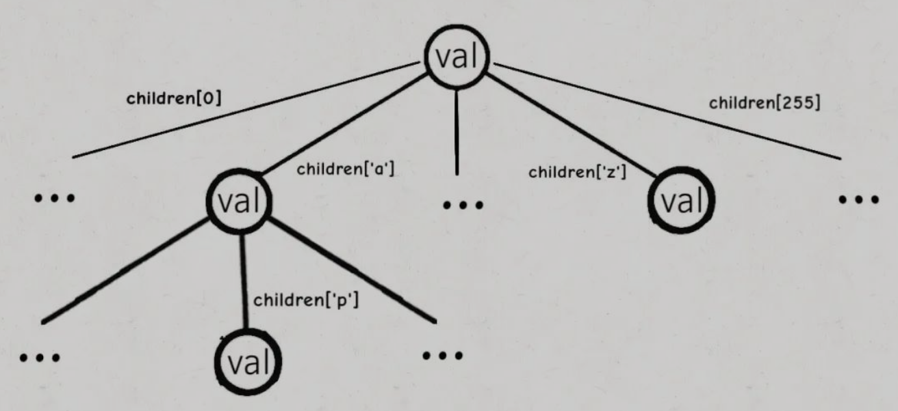
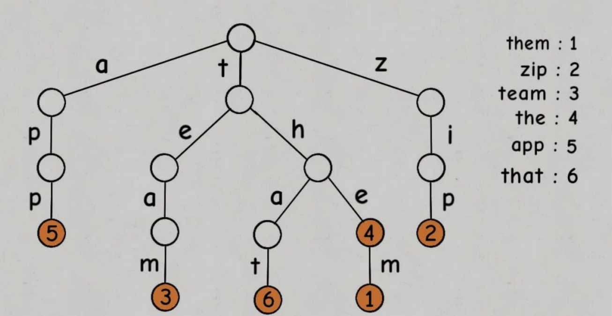

```cpp

#include <map>
#include <string>

class Trie {
public:
  Trie() {
    head = new TrieNode();
  }

  void insert(std::string &world) {
    int len = world.size();
    if (0 == len) {
      return;
    }
    TrieNode *node  = head;
    int       index = 0;

    for (int i = 0; i < len; i++) {
      index = world[i] - 'a';
      if (node->map.count(index) == 0) {
        // 不存在新建节点
        node->map[index] = new TrieNode();
      }

      node = node->map[index];
      node->path++;  // node 经历的path++
    }

    node->end++;  //找到结尾
  }

  // 字典树查找
  bool search(std::string &str) {
    int len = str.size();
    if (len == 0) {
      return false;
    }

    TrieNode *node  = head;
    int       index = 0;

    for (int i = 0; i < len; i++) {
      index = str[i] - '0';
      if (0 == node->map.count(index)) {
        return false;
      }

      node = node->map[index];
    }

    return node->end != 0;
  }

  void deleteNode(std::string str) {
    if (!search(str)) {
      return;
    }

    int       index = 0;
    TrieNode *node  = head;
    for (int i = 0; i < str.size(); i++) {
      index = str[i] - '0';
      if (node->map[index]->path-- == 1) {
        node->map[index] = nullptr;
        return;
      }

      node = node->map[index];
    }

    node->end--;
  }

  // 返回以str为前缀的单词数量
  int findPrifex(std::string &str) {
    int len = str.size();
    if (0 == len) {
      return 0;
    }

    TrieNode *node  = head;
    int       index = 0;

    for (int i = 0; i < len; i++) {
      index = str[i] - '0';
      if (node->map.count(index) == 0) {
        return 0;
      }
      node = node->map[index];
    }

    return node->path;
  }

private:
  struct TrieNode {
    int                       path;  // 有多少单词公用这个节点
    int                       end;   // 有多少单词以这个节点结尾
    std::map<int, TrieNode *> map;

    TrieNode() {
      path = 0;
      end  = 0;
    }
  };

  TrieNode *head;
};
```
## `Trietree`

`trietree`实例：

其中白色节点代表`val`字段为空，橙色节点代表`val`字段非空。
**`trietree`节点本身只存储`val`字段，并没有一个字段来存储字符，字符是通过子节点在父节点的`children`数组中的索引来确定的。**
**`Trie `树用「树枝」存储字符串（键），用「节点」存储字符串（键）对应的数据（值）。所以我在图中把字符标在树枝，键对应的值`val`标在节点上。**
`TrieMap`的实现：
```cpp

#include <cstddef>
#include <list>
#include <map>
#include <memory>
#include <string>
#include <vector>

#define NOT_EXISTS -1

template <typename T>
class TrieMap {
public:
  // 增/改
  // map 中添加key
  void put(std::string &key, T &val) {
    if (!containsKey(key)) {
      size_++;
    }

    put(root, key, val, 0);
  }

  // 删
  void remove(std::string &key) {
    if (!containsKey(key)) {
      return;
    }

    root = remove(root, key, 0);
    size_--;
  }

  // 搜索key对应的值，不存在放回nullptr
  T get(std::string &key) {
    std::shared_ptr<TrieNode> node = getNode(root, key);

    if (node == nullptr || node->val == nullptr) {
      return NOT_EXISTS;
    }

    return *(node->val);
  }

  // 判断key是否存在在map中
  bool containsKey(std::string &key) {
    TrieNode p = getNode(root, key);
    return p != nullptr && p->val != nullptr;
  }

  // 在Map的所有键中搜索query的最小前缀
  std::string shortestPrefix(std::string &query) {
    std::shared_ptr<TrieNode> p = root;
    // 从node节点开始搜索key
    for (int i = 0; i < query.size(); i++) {
      if (p == nullptr) {
        return "";
      }

      if (p->val != nullptr) {
        return query.substr(0, i);
      }

      p = p->children[query[i]];
    }

    // query 本身是一个前缀
    if (p != nullptr && p->val != nullptr) {
      return query;
    }

    return "";
  }

  // 在Map的所有键所有query的最长前缀
  std::string longestPrefix(std::string &query) {
    std::shared_ptr<TrieNode> p      = root;
    int                       maxlen = 0;
    for (int i = 0; i < query.length(); i++) {
      if (p == nullptr) {
        return "";
      }

      if (p->val != nullptr) {
        maxlen = i;
      }

      p = p->children[query[i]];
    }

    if (p != nullptr && p->val != nullptr) {
      return query;
    }

    return query.substr(0, maxlen);
  }

  // 搜索所有前缀为prefix的键
  std::list<std::string> keysWithPrefix(std::string &prefix) {
    std::list<std::string> res;

    TrieNode   *p = getNode(root, prefix);
    std::string path;

    if (p == nullptr) {
      return res;
    }

    traverse(p, path, res);

    return res;
  }

  // 判断是否存在键为prefix的键
  bool hasKeyWithPrefix(std::string &prefix) {
    return getNode(root, prefix) != nullptr;
  }

  // 搜索匹配模式的字符串
  std::list<std::string> keysWithPattern(std::string &pattern) {
    std::string            path;
    std::list<std::string> res;

    traverse(root, path, pattern, 0, res);

    return res;
  }

  //通配符 . 匹配任意字符，判断是否存在匹配的键
  bool hasKeyWithPattern(std::string &pattern) {
    return hasKeyWithPattern(root, pattern, 0);
  }

  // 大小
  int size() const {
    return size_;
  }

private:
  struct TrieNode {
  public:
    TrieNode()
        : val(nullptr), children(std::vector<std::shared_ptr<TrieNode>>(R)) {
    }

  private:
    std::shared_ptr<T>                     val;
    std::vector<std::shared_ptr<TrieNode>> children;
  };

  std::shared_ptr<TrieNode> getNode(std::shared_ptr<TrieNode> node,
                                    std::string              &key) {
    std::shared_ptr<TrieNode> p = node;
    // 从节点node，开始搜索key
    for (int i = 0; i < key.length(); i++) {
      if (p == nullptr) {
        return nullptr;
      }
      p = p->children[key[i]];
    }
    return p;
  }

  void traverse(std::shared_ptr<TrieNode> node,
                std::string              &path,
                std::list<std::string>   &res) {
    if (nullptr == node) {  // 到达底部
      return;
    }

    if (node->val != nullptr) {
      res.push_back(path);
    }

    // 回溯
    for (char c = 0; c < R; c++) {
      path.push_back(c);
      traverse(node->children[c], path, res);
      path.pop_back();
    }
  }

  void traverse(std::shared_ptr<TrieNode> node,
                std::string              &path,
                std::string              &pattern,
                int                       i,
                std::list<std::string>   &res) {
    if (node == nullptr) {
      return;
    }

    if (i == pattern.length()) {
      if (node->val != nullptr) {
        res.push_back(path);
      }

      return;
    }

    char c = pattern[i];

    if (c == '.') {
      for (char j = 0; j < pattern.length(); j++) {
        path.push_back(j);
        traverse(node->children[j], path, pattern, i + 1, res);
        path.pop_back();
      }
    } else {
      path.push_back(c);
      traverse(node->children[c], path, pattern, i + 1, res);
      path.pop_back();
    }
  }

  bool hasKeyWithPattern(std::shared_ptr<TrieNode> node,
                         std::string              &pattern,
                         int                       i) {
    if (node == nullptr) {
      return false;
    }

    if (i == pattern.length()) {
      return node->val != nullptr;
    }

    char c = pattern[i];
    if (c != '.') {
      return traverse(node->children[c], pattern, i + 1);
    }

    for (char j = 0; j < R; j++) {
      if (traverse(node->children[j], pattern, i + 1)) {
        return true;
      }
    }

    return false;
  }

  void put(std::shared_ptr<TrieNode> node, std::string &key, T &val, int i) {
    if (nullptr == node) {
      node = std::make_shared<TrieNode>();
    }

    if (i == key.length()) {
      node->val = std::make_shared<T>(val);
      return node;
    }

    char c            = key[i];
    node->children[c] = put(node->children[c], key, val, i + 1);
    return node;
  }

  std::shared_ptr<TrieNode> remove(std::shared_ptr<TrieNode> node,
                                   std::string              &key,
                                   int                       i) {
    if (nullptr == node) {
      return nullptr;
    }

    if (i == key.length()) {
      node->val = nullptr;
    } else {
      char c            = key[i];
      node->children[i] = remove(node->childe[c], key, i + 1);
    }

    if (nullptr != node) {
      return node;
    }

    for (char c = 0; c < R; c++) {
      if (nullptr != node->children[c]) {
        return node;
      }
    }

    return nullptr;
  }

  static const int R = 256;

  int                       size_;
  std::shared_ptr<TrieNode> root;
};
```