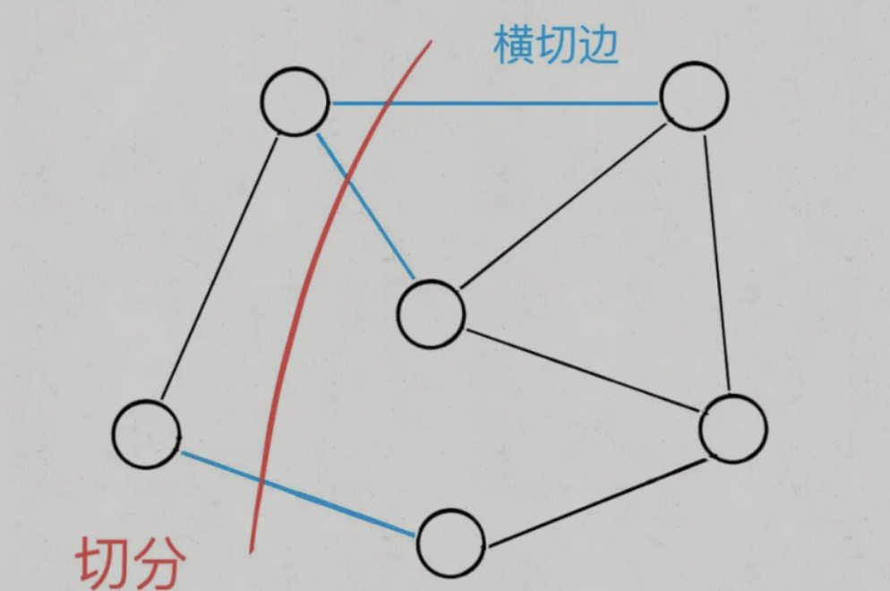

# `prim`算法

算法核心思想为：`BFS`算法思想+`visited`避免形成环, 无需排序，但需要使用优先级队列实现排序效果。

## 切分定理


如图，被红线切中的边，标记为蓝色，称作**横切边**。
**对于任意一种切分，其中权重最小的横切边，一定构成最小生成树的一条边。**

## 算法框架

```cpp
class Prim{
public:
  Prim(std::map<int, std::vector<int> &graph){
    this->graph = graph;
    int n = this->graph.size();
    visited = std::vector<bool>(n, false);

    // 从任意节点切分
    visited[0] = true;
    cut(0);

    // 不断进行切分，向最小生成树中添加边
    while(!pq.isEmpty()){
      std::vector<int> &edge = pq.front();
      pq.pop();
      int to = edge[1];
      int weight = edge[2];

      if(visited[to]){
        // 节点to已经在最小生成树中，跳过
        continue;
      }

      // 将边edge加入最小生成树
      weightSum += weight;
      visited[to] = true;
      // 从to节点开始继续切分
      cut(to);
    }
  }

    int weightSum(){ // 最小生成树权重和
      return weightSum;
    }


    bool allConnected(){ // 判断最小生成树是否包含图中所有的节点
      for(int i=0;i<visited.size();i++){
        if(!visited[i]) {
          return false;
        }
      }

      return true;
    }


private:

  void cut(int s){
    // 将s的横切边加入优先级队列
    // 遍历s的临边
    for(auto edge : graph[s]){
      int to = edge[1];
      if(visited[to]){
        // 相邻节点to已经在最小生成树中，跳过
        // 否则这条边产生环
        continue;
      }

      // 接入横切边队列
      pq.push(edge);
    }

  }


  std::priority_queue<std::vector<int>, std::vector<std::vector<int>>, [](std::vector<int> &t1, std::vector<int> &t2){
    return t1[2] > t2[2];
  }> pq; // 核心数据结构存储横切边的优先级队列,按照权重从小大大排序
  std::vector<bool> visited; // 记录哪些节点已经成为MST的一部分
  int weightSum = 0; // 最小权重和
  std::map<int, std::vector<std::pair<int,int>>> graph;// 邻接表表示的图，记录grap[s]节点s所有的邻接边，三元组[from, to, weight]表示一条边
};
```
