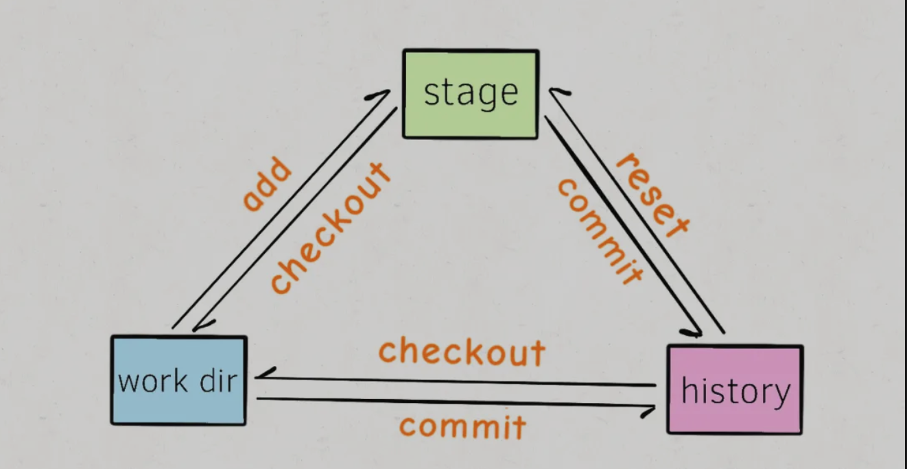

## `Git` 知识总结
### 预备知识
`git`三个分区：`working directory, stage/index area, commit history`

`work directory`: 工作目录，即可视文件；
1. 当在`work directory`中执行`git add `之后，会将`work directory`中的修改提交到`stage area/index area`(暂存区)。
2. 当`stage area`中存在修改时，我们使用`git commit`相关命令后，就会把`stage`中的修改提交到`commit history`中，即`HEAD`指针指向位置。

`work directory`和`stage`中的修改可以通过`git status`查看；
`commit history`中的修改可以通过`git log`查看。

### 极简`git`教程
1. `wrok dirctory `中修改提交到`stage area`
   通过`git add`
   风险：无风险。
2. `stage area`中的修改还原到`work directory`
   利用`git checkout `命令，将`stage area`中的修改覆盖`work directory`中的修改。
   风险： 中风险
3. `stage area`中的修改提交到`commit history`
   通过`git commit`命令
   风险： 无风险
4. `commit history`文件还原到`atsge area`
   `git reset`命令，下一次`commit`时，不会将`reset`的文件提交到`commit history`.
   风险： 低风险
5. `work directory`提交到`commit history`
   利用`add -> commit`或直接利用`git commit -a`
   风险：无风险
6. `commit hisrtory`回滚到`work directory`中
   使用命令:`git checkout HEAD .`
   风险：高风险

