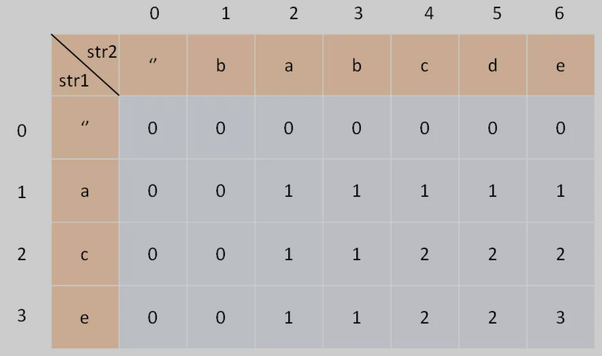
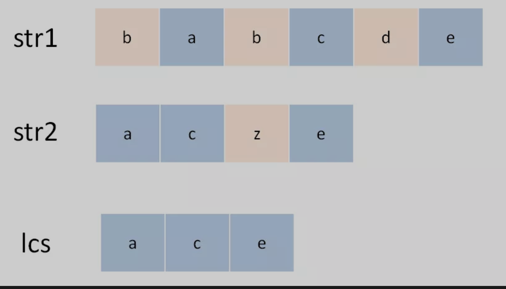

## 子序列问题
### 最长公共子序列问题(子序列不连续)
```
输入: str1 = "abcde", str2 = "ace" 
输出: 3  
解释: 最长公共子序列是 "ace"，它的长度是 3
```
1. 一定要明确`dp`数组的定义，对两个字符串的动态规划问题，套路通用。
比如对于字符串`s1`和`s2`一般构造如下的`dp`数组：

`dp[i][j]`表示在`s1[1..i]和s2[1..j]`中它们的`LCS`长度。
1. 寻找`base class`
将`dp[...][0]`和`dp[0][...]`设置为`0`。
3. 寻找状态转移方程
状态转移说简单些就是做选择，比如说这个问题，是求`s1和s2`的最长公共子序列，不妨称这个子序列为`lcs`。那么对于`s1和s2`中的每个字符，有什么选择？很简单，两种选择，要么在`lcs`中，要么不在。

选择就是，当前字符在与不在`lcs`中。
如何选择？
主要是考虑：
1. 当`s[i] == t[j]`时，`s[i]`一定在`lcs`中，
2. 如果不存在的话，则判断`s[i]`在，`t[j]`不在的情况；`t[j]`在，`s[i]`不在的情况。
   
由此可以得到递归解法：
```cpp
int _longestCommonSubsequence(std::string text1,
                                std::string text2,
                                int         i,
                                int         j) {
    if (i == -1 || j == -1) {
      return 0;
    }

    if (text1[i] == text2[j]) {
      return 1 + _longestCommonSubsequence(text1, text2, i - 1, j - 1);
    } else {
      return std::max(_longestCommonSubsequence(text1, text2, i - 1, j),
                      _longestCommonSubsequence(text1, text2, i, j - 1));
    }
  }
```
改成动态规划如下：
```cpp
class Solution {
public:
  int longestCommonSubsequence(std::string text1, std::string text2) {
    std::vector<std::vector<int>> dp(text1.length() + 1,
                                     std::vector<int>(text2.length() + 1, 0));
    for (int i = 1; i <= text1.size(); i++) {
      for (int j = 1; j <= text2.size(); j++) {
        if (text1[i - 1] == text2[j - 1]) {
          dp[i][j] = dp[i - 1][j - 1] + 1;
        } else {
          dp[i][j] = std::max(dp[i - 1][j], dp[i][j - 1]);
        }
      }
    }
    return dp[text1.length()][text2.length()];
  }
};
```
分析增加求解最长公共子序列：
```cpp
std::string lcs(std::string str1, std::string str2, std::vector<std::vector<int>> &dp){
  int len1 = str1.size();
  int len2 = str2.size();

  std::string res(dp[len1--][len2--]);
  int index = res.size() -1;

  while(index >= 0) {
    if(len1 > 0 && dp[len1][len2] == dp[len1][len2-1]) {
      len1--;
    }else if(len2 > 0 && dp[len1][len2] == dp[len1-1][len2]){
      len2--;
    }else{
      res[index--] = str1[len1];
      len1--;
      len2--;
    }

  }

  return res;
}
```


### 最长递增子序列
```
最长递增子序列（Longest Increasing Subsequence，简写 LIS）是比较经典的一个问题，比较容易想到的是动态规划解法，时间复杂度 O(N^2)
```
分析：
`dp[i] `表示以 `nums[i] `这个数结尾的最长递增子序列的长度。
```cpp
class Solution {
public:
  int lengthOfLIS(std::vector<int>& nums) {
    int              len = nums.size();
    std::vector<int> dp(len + 1, 1);

    for (int i = 1; i < len; i++) {
      for (int j = 0; j < i; j++) {
        if (nums[j] < nums[i]) {
          dp[i] = std::max(dp[i], dp[j] + 1);
        }
      }
    }

    int res = 0;
    for (auto item : dp) {
      res = res > item ? res : item;
    }

    return res;
  }
};
```
所以对单字符串的动态规划的框架：
```cpp
int lengthOfLIS(std::vector<int>& nums) {
    int              len = nums.size();
    // 初始化dp数组
    std::vector<int> dp(len + 1, 1);

    // 对从j->i的dp
    for (int i = 1; i < len; i++) {
      for (int j = 0; j < i; j++) {
        // dp数组处理
      }
    }

    // 结果求解
    int res = 0;
    for (auto item : dp) {
      res = res > item ? res : item;
    }

    return res;
  }
```
分析增加求最长递增子序列的过程：
```cpp
std::vector<int> generateLIS(std::vector<int> &nums, std::vector<int> &dp){
  int len = 0;
  int index = 0;

  for(int i = 0;i<dp.size(); i++) {
    if(dp[i] > len) {
      len = dp[i];
      index = i;
    }
  }

  std::vector<int> res = std::vector<int>(len);
  res[--len] = arr[index];

  for(int i = index;i>=0; i--) {
    if(arr[i] < arr[index] && dp[i] == dp[index] - 1){
      res[--len] = arr[i];
      index = i;
    }
  }


  return res;
}
```

### 最长公共子串问题(公共子串连续)
```cpp
std::vector<std::vector<int>> getDp(std::string str1, std::string str2){
  int len1 = str1.size();
  int len2 = str2.size();

  std::vector<std::vector<int>> dp = std::vector<std::vector<int>>(len1, std::vector<int> (len2, 0));

  // base case 
  for(int i = 0;i<len1;i++) {
    if(str1[i] == str2[0]){
      dp[i][0] = 1;
    }
  }

  for(int j =1;j<len2;j++){
    if(str2[j] == str1[0]){
      dp[0][j] = 1;
    }
  }

  //计算dp
  for(int i = 1;i<len1; i++){
    for(int j = 1;j<len2;j++){
      if(str1[i] == str2[j]) {
        dp[i][j] = dp[i-1][j-1] + 1;
      }
    }
  }

  return dp;
}


// 求公共子串
std::string lcst(std::string str1, std::string str2, std::vector<std::vector<int>> &dp)  {
  int len1 = str1.size();
  int len2 = str2.size();

  int end = 0;
  int max = 0;

  for(int i = 0;i<len1;i++) {
    for(int j = 0; j < len2;j++){
      if(dp[i][j] > max) {
        end = i;
        max = dp[i][j];
      }
    }

  }

  return str1(end-max+1, max);
}
```


