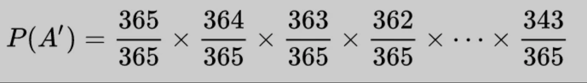
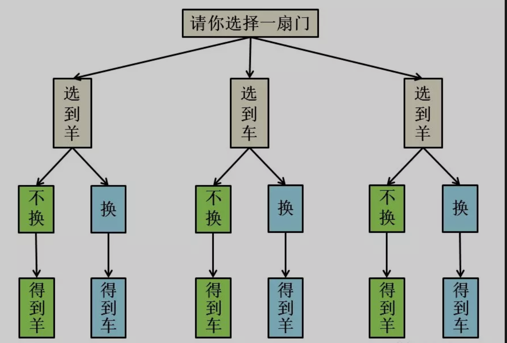

## 三个反直觉概率问题
### 计算概率的基本原则
计算概率的两个最简单原则：
1. 计算概率一定有一个参照系，即样本空间；也就是随机事件可能出现的所有结果。
   $$ 事件A的概率 = A包含的样本点 \div 样本空间的样本总数 $$
2. 概率是一个连续整体，也就是条件概率。

#### 男孩女孩问题
```
假设有一个家庭，有两个孩子，现在告诉你其中有一个男孩，请问另一个也是男孩的概率是多少？
```
> 有两个孩子，那么样本空间为 4，即哥哥妹妹，哥哥弟弟，姐姐妹妹，姐姐弟弟这四种情况。
> 已知有一个男孩，那么排除姐姐妹妹这种情况，所以样本空间变成 3。
> 另一个孩子也是男孩的话，只有哥哥弟弟这 1 种情况，所以概率为 1/3。

#### 生日悖论
```
一个屋子里需要有多少人，才能使得存在至少两个人生日是同一天的概率达到 50%？
```

通过分析，可以得出为`23`人。

#### 三门问题
```
游戏参与者面对三扇门，其中两扇门后面是山羊，一扇门后面是跑车。
参与者只要随便选一扇门，门后面的东西就归他（跑车的价值当然更大）。
但是主持人决定帮一下参与者：在他选择之后，先不急着打开这扇门，而是由主持人打开剩下两扇门中的一扇，展示其中的山羊（主持人知道每扇门后面是什么），然后给参与者一次换门的机会，此时参与者应该换门还是不换门呢？
```

换门中跑车的概率是 `2/3`，不换的话是 `1/3。`

#### `LRU`算法

