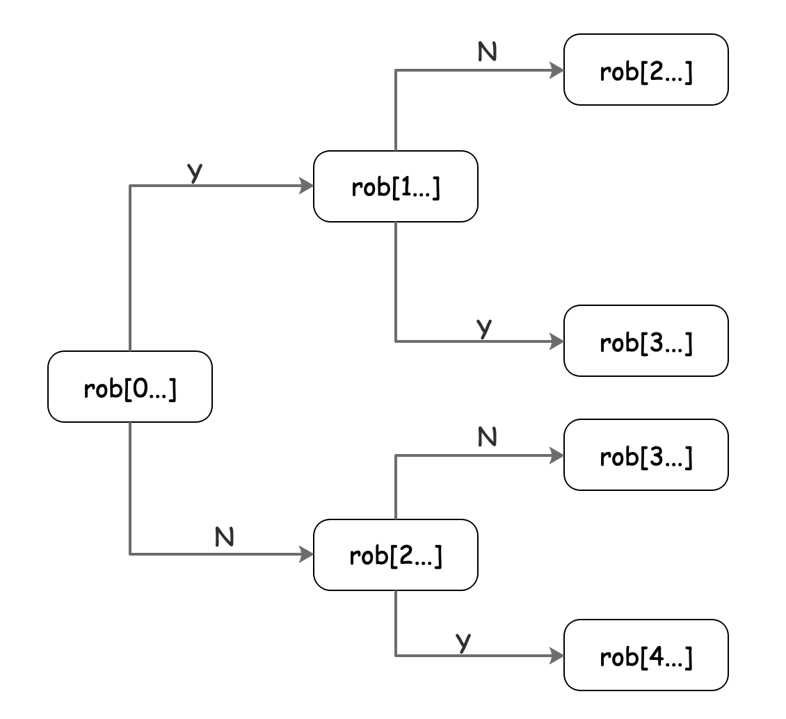

## 打家劫舍问题
### 数组打家劫舍
```
你是一个专业的小偷，计划偷窃沿街的房屋。每间房内都藏有一定的现金，影响你偷窃的唯一制约因素就是相邻的房屋装有相互连通的防盗系统，如果两间相邻的房屋在同一晚上被小偷闯入，系统会自动报警。

给定一个代表每个房屋存放金额的非负整数数组，计算你 不触动警报装置的情况下 ，一夜之内能够偷窃到的最高金额。
```
分析：
对每个房间都有两种选择：打劫与不打劫，递归的方法，就是从第一个遍历的进行选择到最后一个。

递归解法：
```cpp
class Solution {
public:
  int rob(std::vector<int>& nums) {
    return rob(nums, 0);
  }

private:
  int rob(std::vector<int>& nums, int start) {
    if (start >= nums.size()) {
      return 0;
    }

    return std::max(rob(nums, start + 1), nums[start] + rob(nums, start + 2));
  }
};
```
通过决策树可以看出，状态上存在多个重复计算的子树，使用备忘录方法改进有：
```cpp
class Solution {
public:
  int rob(std::vector<int>& nums) {
    memo = std::vector<int>(nums.size() + 1, -1);
    return rob(nums, memo, 0);
  }

private:
  int rob(std::vector<int>& nums, std::vector<int>& memo, int start) {
    if (start >= nums.size()) {
      return 0;
    }
    if (-1 != memo[start]) {
      return memo[start];
    }

    memo[start] = std::max(rob(nums, memo, start + 1),
                           nums[start] + rob(nums, memo, start + 2));

    return memo[start];
  }

  std::vector<int> memo;
};
```
通过备忘录方法可以推到出动规划公式：
$$ dp[i] = std::max(dp[i+1], nums[i]+dp[i+2]) $$
对于递推公式为： 
1. **加法的，一般从后向前计算，即从`n到0`**
2. **减法的，一般从前向后计算，即从`0到n`**

```cpp
class Solution {
public:
  int rob(std::vector<int>& nums) {
    int              size = nums.size();
    std::vector<int> dp(size + 2, 0);
    for (int i = size - 1; i >= 0; i--) {
      dp[i] = std::max(dp[i + 1], dp[i + 2] + nums[i]);
    }

    return dp[0];
  }
};
```
 
### 环形队列打家劫舍问题
```cpp
强盗依然不能抢劫相邻的房子，输入依然是一个数组，但是告诉你这些房子不是一排，而是围成了一个圈
```
分析：
> 针对特殊的首尾的房间有以下三种处理方式：
> 1. 首尾都不抢；
> 2. 开始抢，最后不抢；
> 3. 开始不抢，最后抢。

通过分析：对第一种情况其结果一定小于后两种情况。

```cpp
class Solution {
public:
  int rob(std::vector<int>& nums) {
    int len = nums.size();
    if (1 == len) {
      return nums[0];
    }

    // 分别对应第一间不抢，和最后一间不抢
    return std::max(rob(nums, 1, len - 1), rob(nums, 0, len - 2));
  }

private:
  // 求区间内最大值
  int rob(std::vector<int>& nums, int start, int end) {
    std::vector<int> dp(nums.size() + 2, 0);

    for (int i = end; i >= start; i--) {
      dp[i] = std::max(dp[i + 1], dp[i + 2] + nums[i]);
    }

    return dp[start];
  }
};
```
### 二叉树上打劫

分析：
解法与上述题目相似，当`root`面临抢和不抢的选择：
> 1. 抢时，递归的计算`root->left`(左子树)上的左右子树和`root->right`(右子树)的左右子树抢与不抢的和与`root->val`
> 2. 不抢时，计算`root->left`和`root->right`抢与不抢的和
> 3. 比较上述两个和的最大值，即为所求。
```cpp
class Solution {
public:
  int rob(TreeNode *root) {
    if (root == nullptr) {
      return 0;
    }
    if (memo.count(root)) {
      return memo[root];
    }

    int not_rob = rob(root->left) + rob(root->right);

    int robb = root->val +
               (root->left == nullptr
                    ? 0
                    : rob(root->left->left) + rob(root->left->right)) +
               (root->right == nullptr
                    ? 0
                    : rob(root->right->left) + rob(root->right->right));

    memo[root] = std::max(robb, not_rob);

    return memo[root];
  }

private:
  std::unordered_map<TreeNode *, int> memo;
};
```

