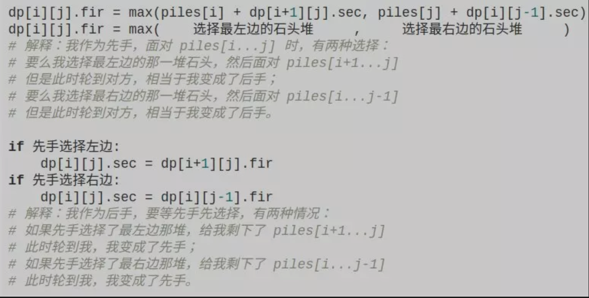
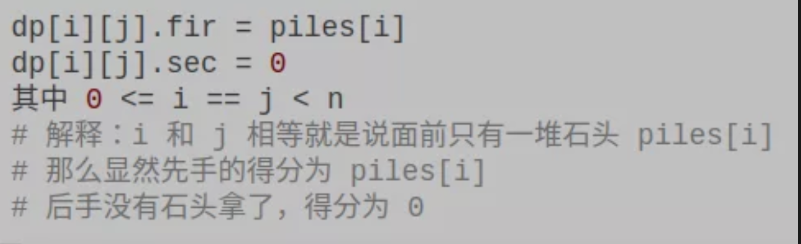

```
你和你的朋友面前有一排石头堆，用一个数组 piles 表示，piles[i] 表示第 i 堆石子有多少个。你们轮流拿石头，一次拿一堆，但是只能拿走最左边或者最右边的石头堆。所有石头被拿完后，谁拥有的石头多，谁获胜。
石头的堆数可以是任意正整数，石头的总数也可以是任意正整数，这样就能打破先手必胜的局面了。比如有三堆石头 piles = [1,100,3]，先手不管拿 1 还是 3，能够决定胜负的 100 都会被后手拿走，后手会获胜。
假设两人都很聪明，请你设计一个算法，返回先手和后手的最后得分（石头总数）之差。比如上面那个例子，先手能获得 4 分，后手会获得 100 分，你的算法应该返回 -96。
```
分析：
1. `dp[i][j].fir` 表示，对于 `piles[i..j]` 这部分石头堆，先手能获得的最高分数。
2. `dp[i][j].sec` 表示，对于 `pilest[i..j]`这部分石头堆，后手能获得的最高分数。

状态：开始的索引`i`,结束的索引`j`和当前轮到的人
```cpp
dp[i][j][fir or sec]
其中：
0 <= i < piles.length
i <= j < piles.length
```
对每个状态有两种选择：选择最左边或最右边的一堆石头。
```cpp
n = piles.size();
for 0 <= i < n {
    for j <= i < n {
        for who in {frc, sec} {
            dp[i][j][who] = std::max(left, right);
        }
    }
}
```

`base case`:

```cpp
#include <vector>

// 返回先后手分值差
int stoneGame(std::vector<int> &piles) {
  int n = piles.size();
  if (n == 0) {
    return 0;
  }

  std::vector<std::vector<std::pair<int, int>>> dp =
      std::vector<std::vector<std::pair<int, int>>>(
          n + 1,
          std::vector<std::pair<int, int>>(n + 1, std::make_pair(0, 0)));

  // base case
  for (int i = 0; i < n; i++) {
    dp[i][0] = std::make_pair(piles[i], 0);
  }

  // 计算dp数组
  for (int i = 2; i <= n; i++) {
    for (int j = 0; j <= n - 1; j++) {
      // 斜着遍历数组
      int l = i + j - 1;
      // 先手选择左边或右边的石子
      int left  = piles[i] + dp[i + 1][j].second;
      int right = piles[j] + dp[i][j - 1].second;

      // 套用状态转移方程
      if (left > right) {
        dp[i][j].first  = left;
        dp[i][j].second = dp[i + 1][j].first;
      } else {
        dp[i][j].first  = right;
        dp[i][j].second = dp[i][j - 1].first;
      }
    }

    auto res = dp[0][n - 1];

    return res.second - res.first;
  }
}

```
