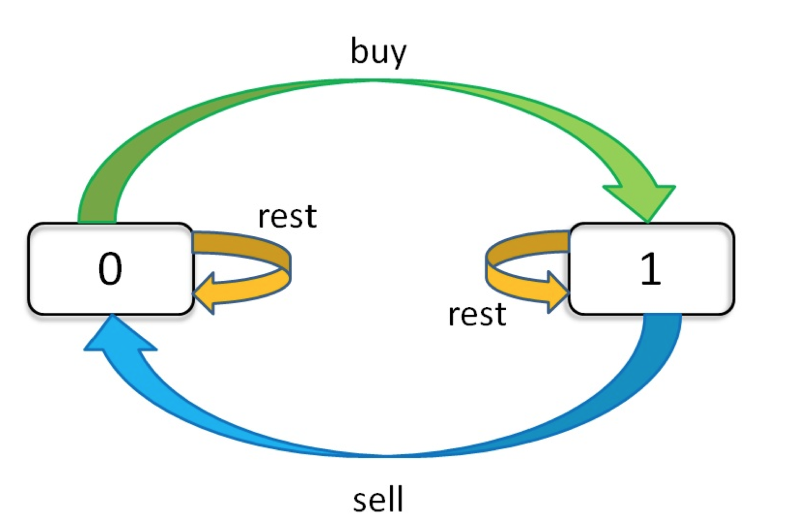

# 动态规划
动态规划一般均为求值问题，核心为穷举，存在最优子结构。
子问题中含有大量的重复计算。
## 斐波那契数列
暴力求解：
```cpp
int fib(int N) {
  if(1 == N || 2 == N) {
    return 1;
  }

  return fib(N-1) + fib(N-2);
}
```
备忘录方式：
```cpp
int fib(int N){
  if(0 > N) {
    return -1;
  }
  std::vector<int> memo(N+1,0);
  return helper(memo, N);
}

int helper(std::vector<int> &memo, int N){
  // base case
  if(1 == N || 2 == N) {
    return 1;
  }

  if(0 != memo[N]) {
    return memo[N];
  }
  memo[N] = helper(memo, N-1) + helper(memo, N-2);
  return memo[N];
}

```
从备忘录方法可以推导出动态规划方法：
```cpp
int fib(int N) {
  if(1 == N || 2 == N) {
    return 1;
  }
  std::vector<int> dp(N+1, 0);
  // base case
  dp[0] = dp[1] = 1;
  for(int i = 2; i <= N; ++i) {
    dp[i] = dp[i+1] + dp[i+2];
  }

  return dp[N];
}
```
## 凑零钱问题
```
给你k种面值的硬币，面值分别为c1, c2 ... ck，每种硬币的数量无限，再给一个总金额amount，问你最少需要几枚硬币凑出这个金额，如果不可能凑出，算法返回 -1 。
算法框架：

// coins 中是可选硬币面值，amount 是目标金额
int coinChange(std::vector<int> &coins, int amount);
```
暴力求解：
```cpp
int coinChange(std::vector<int> &coins, int amount) {
  // amount == 0
  if(0 == n) {
    return 1;
  }

  // amount < 0 
  if(0 > n) {
    return -1;
  }

  int res = INT_MAX;
  for(auto coin : coins) {
    int subproblem = coinChange(coins, amount);
    if(-1 == subproblem) {
      continue;
    }

    res = std::min(res, 1 + subproblem);
  }

  return res == INT_MAX ? -1 : res;
}
```
备忘录方式：
```cpp
int coinChange(std::vector<int> &coins, int amount) {
  if(amount < 0 ) {
    return -1;
  }
  std::vector<int> memo(amount+1, -1);
  return helper(coins, memo, amount);
}

int helper(std::vector<int> &coins,std::vector<int> &memo, int amount){

  if(-1 != memo[amount]) {
    return memo[amount];
  }

  // amount == 0
  if(0 == n) {
    return 1;
  }

  // amount < 0 
  if(0 > n) {
    return -1;
  }

  int res = INT_MAX;
  for(auto coin : coins) {
    int subproblem = coinChange(coins, amount);
    if(-1 == subproblem) {
      continue;
    }

    res = std::min(res, 1 + subproblem);
  }

  return memo[amount] = (res == INT_MAX ? -1 : res);
}
```
动态规划解法：
```cpp
int coinChange(std::vector<int> &coins, int amount) {
  if(amount < 0 ) {
    return -1;
  }
  std::vector<int> dp(amount+1, -1);
  dp[0] = 0;
  for(int i=0;i<dp.size();++i){
    for(auto coin : coins){
      if(i - coin < 0) {
        cotinue;
      }
      dp[i] = std::min(dp[i], i+dp[i-coin]);
    }
  }
  return dp[amount] == amount+1 ? -1:dp[amount];
}
```

## 股票买卖问题
穷举框架：
```cpp
for 状态1 in 状态1的所有取值 {
  for 状态2 in 状态2的所有取值 {
    for ... {
      dp[状态1][状态2][...] = 择优(选择1，选择2，...)
    }
  }
}
```
针对股票问题有三种选择：买入，卖出，无操作 ==> `buy,sell,reset`(代表其状态)
对其有次序要求：
1. `sell`必须在`buy`之后；
2. `buy`必须在`sell`之前。

因此`reset`应该有两种状态:
1. `buy`之后的`reset`;
2. `sell`之后`reset`。

因此其共有三种状态：
> 天数，交易次数，当前持有状态(0->没有持有，1->持有)

利用一个三维数组可以表示全部状态组合：
`dp[i][k][0 or 1]`,$0<=i<n, 1 <= k < K $。
其中`n为天数，K为最大交易次数`.
全部状态的枚举为：
```cpp
for 0 <= i < n {
  for 0 <= k < K {
    for s in {0,1} {
      dp[i][k][s] = max(buy, sell, reset)
    }
  }
}
```
对`dp table`可以描述为：
`dp[3][2][1]`:今天是第三天，我持有股票，至今最多进行过两次交易；
`dp[2][3][0]`:今天是第2天，我没有持有股票，至今最多交易三次。

题目转变为求`dp[n-1][K][0]`的最大值，即最后一天，我没有持有股票，最多交易`K`次的最大收益。
### 状态转移方程
其状态转移图为：
  
状态转移方程为：
```text
dp[i][k][0] = max(dp[i-1][k][0], dp[i-1][k][1] + prices[i] )
            = max(  选择reset,  选择sell  )
解释：今天没有股票有两种可能
1. 前一天没有股票，今天也没购买
2. 前一天有股票，今天卖出

dp[i][k][1] = max(dp[i-1][k][1], dp[i-1][k -1][0] - prices[i])
            = max(  选择继续持有，   选择买入 )
解释：今天持有股票有两种可能
1. 前一天有股票，今天继续持有
2. 前一天没有股票，今天买入
```
定义`base case`:
```text
dp[-1][k][0] = 0
解释：i从0开始，i=-1表示还没开始。
dp[-1][k][1] = -infinity
解释：还没开始时，不能持有股票所以为负无穷
dp[i][0][0] = 0
解释：k从1开始，k=0时不允许交易，利润为0
dp[i][0][1] = -infinity
解释：k从1开始，k=0时不允许交易,不能持有股票,所以为负无穷
```
状态转移方程：
```text
base case:
dp[-1][k][0] = dp[i][0][0] = 0
dp[-1][k][1] = dp[i][0][1] = -infinity

状态转移方程：
dp[i][k][0] = max(dp[i-1][k][0], dp[i-1][k][1] + prices[i])
dp[i][k][1] = max(dp[i-1][k][1], dp[i-1][k-1][0] - prices[i])

最终结果：
dp[n-1][k][0]
```
## 经典动态规划
### 高楼扔鸡蛋
> 你⾯前有⼀栋从 1 到 N 共 N 层的楼，然后给你 K 个鸡蛋
>（ K ⾄少为 1）。现在确定这栋楼存在楼层 0 <= F <= N ，在这层楼将鸡
>蛋扔下去，鸡蛋恰好没摔碎（⾼于 F 的楼层都会碎，低于 F 的楼层都不
>会碎）。现在问你，最坏情况下，你⾄少要扔⼏次鸡蛋，才能确定这个楼层
>F 呢？


