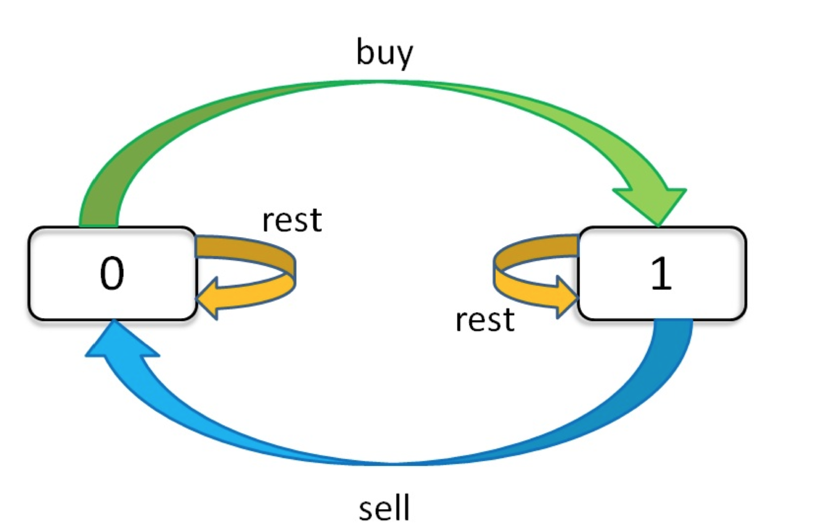

# 动态规划
## 股票买卖问题
穷举框架：
```cpp
for 状态1 in 状态1的所有取值 {
  for 状态2 in 状态2的所有取值 {
    for ... {
      dp[状态1][状态2][...] = 择优(选择1，选择2，...)
    }
  }
}
```
针对股票问题有三种选择：买入，卖出，无操作 ==> `buy,sell,reset`(代表其状态)
对其有次序要求：
1. `sell`必须在`buy`之后；
2. `buy`必须在`sell`之前。

因此`reset`应该有两种状态:
1. `buy`之后的`reset`;
2. `sell`之后`reset`。

因此其共有三种状态：
> 天数，交易次数，当前持有状态(0->没有持有，1->持有)

利用一个三维数组可以表示全部状态组合：
`dp[i][k][0 or 1]`,$0<=i<n, 1 <= k < K $。
其中`n为天数，K为最大交易次数`.
全部状态的枚举为：
```cpp
for 0 <= i < n {
  for 0 <= k < K {
    for s in {0,1} {
      dp[i][k][s] = max(buy, sell, reset)
    }
  }
}
```
对`dp table`可以描述为：
`dp[3][2][1]`:今天是第三天，我持有股票，至今最多进行过两次交易；
`dp[2][3][0]`:今天是第2天，我没有持有股票，至今最多交易三次。

题目转变为求`dp[n-1][K][0]`的最大值，即最后一天，我没有持有股票，最多交易`K`次的最大收益。
### 状态转移方程
其状态转移图为：
  
状态转移方程为：
```text
dp[i][k][0] = max(dp[i-1][k][0], dp[i-1][k][1] + prices[i] )
            = max(  选择reset,  选择sell  )
解释：今天没有股票有两种可能
1. 前一天没有股票，今天也没购买
2. 前一天有股票，今天卖出

dp[i][k][1] = max(dp[i-1][k][1], dp[i-1][k -1][0] - prices[i])
            = max(  选择继续持有，   选择买入 )
解释：今天持有股票有两种可能
1. 前一天有股票，今天继续持有
2. 前一天没有股票，今天买入
```
定义`base case`:
```text
dp[-1][k][0] = 0
解释：i从0开始，i=-1表示还没开始。
dp[-1][k][1] = -infinity
解释：还没开始时，不能持有股票所以为负无穷
dp[i][0][0] = 0
解释：k从1开始，k=0时不允许交易，利润为0
dp[i][0][1] = -infinity
解释：k从1开始，k=0时不允许交易,不能持有股票,所以为负无穷
```
状态转移方程：
```text
base case:
dp[-1][k][0] = dp[i][0][0] = 0
dp[-1][k][1] = dp[i][0][1] = -infinity

状态转移方程：
dp[i][k][0] = max(dp[i-1][k][0], dp[i-1][k][1] + prices[i])
dp[i][k][1] = max(dp[i-1][k][1], dp[i-1][k-1][0] - prices[i])

最终结果：
dp[n-1][k][0]
```


